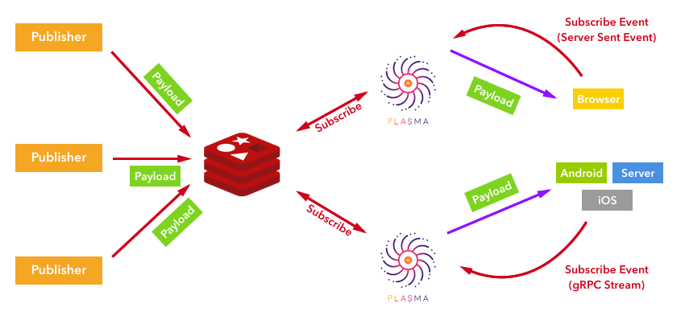

plasma
==========

[](https://circleci.com/gh/openfresh/plasma)
[](https://golang.org/)
[](https://github.com/openfresh/plasma/issues?state=open)
[](LICENSE)
[](https://imagelayers.io/?images=openfresh/plasma:latest 'Get your own badge on imagelayers.io')


plasma is event push middleware by using gRPC stream.

## Description

Plasma is middleware for sending event specialized for a stream. Plasma provides EventSource and gRPC Stream from the same endpoint.



## Installation

This middleware requires Redis.

### From Source

```bash
$ git clone git://github.com/openfresh/plasma.git $GOPATH/src/github.com/openfresh/plasma
$ cd  $GOPATH/src/github.com/openfresh/plasma
$ make deps
$ make build
```

The binary is generated under the `bin/` directory.

### Using docker

You can also use the Docker image.

```bash
$ docker run -p 8080:8080 openfresh/plasma
```

### Using docker-compose

You can use docker-compose for easy use without preparing Redis.

```bash
$ git clone git://github.com/openfresh/plasma.git $GOPATH/src/github.com/openfresh/plasma
$ cd  $GOPATH/src/github.com/openfresh/plasma
$ docker-compose up -d
```

# Usage Subscriber

## Server Sent Events

[Using server-sent events](https://developer.mozilla.org/en-US/docs/Web/API/Server-sent_events/Using_server-sent_events)

Your can use SSE if you request with `Accept:text-stream` header.

You request events that you want to subscribe to this endpoint. You can specify multiple events separated by commas.
The query name can be set with the `EventQuery` environment variable．(default value of EventQuery is  `eventType` )．

Here is a simple example using [Yaffle / EventSource] (https://github.com/Yaffle/EventSource).

```javascript
    var source = new EventSource('//localhost:8080/?eventType=program:1234:views,program:1234:poll,program:1234:annotation');
    
    source.addEventListener("open", function(e) {
        console.log("open");
    });
    
    source.addEventListener("error", function(e) {
        console.log("error");
    });
    
    source.addEventListener("message", function(e) {
        console.log("message event: ", e.data);
    });
```

The JSON schema of data returned from Plasma is as follows.

```javascript
{
    "$schema": "http://json-schema.org/draft-04/schema#",
    "id": "/events",
    "properties": {
        "data": {
            "id": "/events/data",
            "type": "string"
        },
        "meta": {
            "id": "/events/meta",
            "properties": {
                "type": {
                    "id": "/events/meta/type",
                    "type": "string"
                }
            },
            "type": "object"
        }
    },
    "type": "object"
}
```

If the `DEBUG` environment variable is enabled, you can access the debug endpoint.

### GET /debug

You can publish events to Redis from this endpoint.  You need to enter valid JSON in EventData form.

## gRPC Stream

You can subscribe to events using gRPC Stream.

The ProtocolBuffer file is [here](https://github.com/openfresh/plasma/blob/master/protobuf/stream.proto) .

The following is a simple Go sample.

```go
func main() {
	conn, err := grpc.Dial("localhost:8080", grpc.WithInsecure())
	if err != nil {
		log.Fatal(err)
	}
	defer conn.Close()

	client := proto.NewStreamServiceClient(conn)
	ctx := context.Background()

	req := proto.Request{
		Events: []*proto.EventType{
			eventType("program:1234:poll"),
			eventType("program:1234:views"),
		},
	}
	
	ss, err := client.Events(ctx, &req)
	if err != nil {
		log.Fatal(err)
	}
	
	for {
		resp, err := ss.Recv()
		if err != nil {
			log.Println(err)
			continue
		}
		if resp == nil {
			log.Println("payload is nil")
			continue
		}
		fmt.Printf("Meta: %s\tData: %s\n", resp.EventType.Type, resp.Data)
	}
}
```

# Usage Publisher

You publish events to the channel that Plasma subscribes according to the following JSON Schema.

```javascript
{
    "$schema": "http://json-schema.org/draft-04/schema#",
    "id": "/events",
    "properties": {
        "data": {
            "id": "/events/data",
            "type": "string"
        },
        "meta": {
            "id": "/events/meta",
            "properties": {
                "type": {
                    "id": "/events/meta/type",
                    "type": "string"
                }
            },
            "type": "object"
        }
    },
    "type": "object"
}
```

[openfresh/plasma-go](https://github.com/openfresh/plasma-go) is a library that wraps publish an event to Redis.

## HealthCheck

### GET /hc

You can do a health check. Check the status of Redis.
If there is a problem it returns 500, and if there is no problem it returns 200.

## Metrics

### GET /metrics

You can get metrics from this endpoint.

The following metrics can be taken.

| name                | type      | desc                                                                  |
|---------------------|-----------|-----------------------------------------------------------------------|
| go_version          | string    | version of go                                                         |
| go_os               | string    | os                                                                    |
| go_arch             | string    | arch                                                                  |
| cpu_num             | int       | number of cpus                                                        |
| goroutine_num       | int       | number of goroutines                                                  |
| gomaxprocs          | int       | number of operating system threads                                    |
| cgo_call_num        | int64     | number of cgo calls                                                   |
| memory_alloc        | uint64    | bytes of allocated heap objects                                       |
| memory_total_alloc  | uint64    | cumulative bytes allocated for heap objects                           |
| memory_sys          | uint64    | total bytes of memory                                                 |
| memory_lookups      | uint64    | number of pointer                                                     |
| memory_mallocs      | uint64    | cumulative count of heap objects allocated                            |
| memory_frees        | uint64    | cumulative count of heap objects freed                                |
| memory_stack        | uint64    | bytes in stack spans                                                  |
| heap_alloc          | uint64    | bytes of allocated heap objects                                       |
| heap_sys            | uint64    | bytes of heap memory obtained                                         |
| heap_idle           | uint64    | bytes in idle spans                                                   |
| heap_inuse          | uint64    | bytes in in-use spans                                                 |
| heap_released       | uint64    | bytes of physical memory returned to the OS                           |
| heap_objects        | uint64    | number of allocated heap objects                                      |
| gc_next             | uint64    | target heap size of the next GC cycle                                 |
| gc_last             | uint64    | time the last garbage collection finished, as, nanoseconds since 1970 |
| gc_num              | uint32    | number of completed GC cycles                                         |
| gc_per_second       | float64   | GC per second                                                         |
| gc_pause_per_second | float64   | GC pause per second                                                   |
| gc_pause            | []float64 | GC pause                                                              |
| connections         | int64     | number of connected clients                                           |

## Config

| name                                            | type          | desc                                                                                  | default           | note                                                                               |
|-------------------------------------------------|---------------|---------------------------------------------------------------------------------------|-------------------|------------------------------------------------------------------------------------|
| PLASMA_PORT                                     | string        | port number                                                                           | 8080              |                                                                                    |
| PLASMA_DEBUG                                    | bool          | debug mode                                                                            | false             |                                                                                    |
| PLASMA_ORIGIN                                   | string        | set to Access-Controll-Allow-Origin                                                   |                   |                                                                                    |
| PLASMA_SSE_RETRY                                | int           | reconnect to the source milliseconds after each connection is closed                  | 2000              |                                                                                    |
| PLASMA_SSE_EVENTQUERY                           | string        | use as a querystring in SSE                                                           | eventType         | ex) /?eventType=program:1234:views                                                 |
| PLASMA_SUBSCRIBER_TYPE                          | string        | subscriber type                                                                       | mock              | support "mock" and "redis"                                                         |
| PLASMA_SUBSCRIBER_REDIS_ADDR                    | string        | Redis address including port number                                                   | localhost:6379    |                                                                                    |
| PLASMA_SUBSCRIBER_REDIS_PASSWORD                | string        | Redis password                                                                        |                   |                                                                                    |
| PLASMA_SUBSCRIBER_REDIS_DB                      | int           | Redis DB                                                                              | 0                 |                                                                                    |
| PLASMA_SUBSCRIBER_REDIS_CHANNELS                | string        | channels of Redis to subscribe (multiple specifications possible)                     |                   |                                                                                    |
| PLASMA_SUBSCRIBER_REDIS_OVER_MAX_RETRY_BEHAVIOR | string        | Behavior of plasma when the number of retries connecting to Redis exceeds the maximum |                   | "die" or "alive"                                                                   |
| PLASMA_SUBSCRIBER_REDIS_TIMEOUT                 | time.Duration | timeout for receive message from Redis                                                | 1s                |                                                                                    |
| PLASMA_SUBSCRIBER_REDIS_RETRY_INTERVAL          | time.Duration | interval for retry to receive message from Redis                                      | 5s                |                                                                                    |
| PLASMA_ERROR_LOG_OUT                            | string        | log file path                                                                         |                   | stdout, stderr, filepath                                                           |
| PLASMA_ERROR_LOG_LEVEL                          | string        | log output level                                                                      |                   | panic,fatal,error,warn,info,debug                                                  |
| PLASMA_ACCESS_LOG_OUT                           | string        | log file path                                                                         |                   | stdout, stderr, filepath                                                           |
| PLASMA_ACCESS_LOG_LEVEL                         | string        | log output level                                                                      |                   | panic,fatal,error,warn,info,debug                                                  |
| PLASMA_TLS_CERT_FILE                            | string        | cert file path                                                                        |                   | TLS is enabled only when you set both PLASMA_TLS_CERT_FILE and PLASMA_TLS_KEY_FILE |
| PLASMA_TLS_KEY_FILE                             | string        | key file path                                                                         |                   |                                                                                    |
| PLASMA_METRICS_TYPE                             | string        | metrics type                                                                          |                   | support "log" or "syslog". if this value is empty, metrics will be disabled        |
| PLASMA_METRICS_INTERVAL                         | time.Duration | interval for update metrics                                                           | 10s               |                                                                                    |
| PLASMA_METRICS_LOG_OUT                          | string        | log file path                                                                         | stdout            |                                                                                    |
| PLASMA_METRICS_LOG_PREFIX                       | string        | log prefix                                                                            | metrics           |                                                                                    |
| PLASMA_METRICS_LOG_FLAG                         | int           | define which text to prefix to each log entry generated by the Logger                 | log.Lmicroseconds | https://golang.org/pkg/log/#pkg-constants                                          |
| PLASMA_METRICS_LOG_INTERVAL                     | time.Duration | interval for send to logger                                                           | 1m                |                                                                                    |
| PLASMA_METRICS_SYSLOG_TAG                       | string        | tag for syslog                                                                        | plasma            |                                                                                    |
| PLASMA_METRICS_SYSLOG_INTERVAL                  | time.Duration | interval for send to syslog                                                           | 1m                |                                                                                    |
| PLASMA_METRICS_SYSLOG_SEVERITY                  | int           | syslog serverity                                                                      | 0                 | https://golang.org/pkg/log/syslog/#Priority                                        |
| PLASMA_METRICS_SYSLOG_FACILITY                  | int           | syslog facility                                                                       | 0                 | https://golang.org/pkg/log/syslog/#Priority                                        |
| PLASMA_METRICS_SYSLOG_FACILITY                  | int           | syslog facility                                                                       | 0                 | https://golang.org/pkg/log/syslog/#Priority                                        |
| PLASMA_METRICS_SYSLOG_NETWORDK                  | string        | network for syslog                                                                    |                   |                                                                                    |
| PLASMA_METRICS_SYSLOG_ADDR                      | string        | address for syslog                                                                    |                   |                                                                                    |


License
===
See [LICENSE](LICENSE).

Copyright © CyberAgent, Inc. All Rights Reserved.
